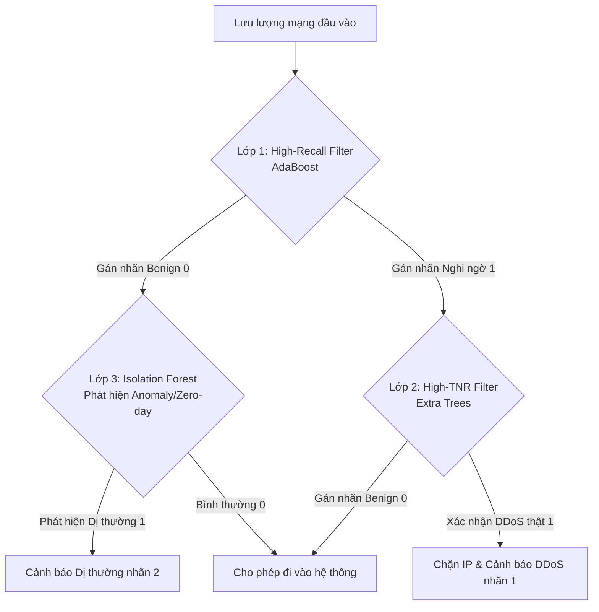

# Hệ Thống Phát Hiện Xâm Nhập Mạng (IDS) Ứng Dụng Trí Tuệ Nhân Tạo (AI)
### 👥 Bài tập lớn Nhóm 10 - An toàn thông tin

Dự án này là một ứng dụng phát hiện xâm nhập mạng (IDS) hoàn chỉnh, kết hợp cả học máy có giám sát (Supervised Learning) và học không giám sát (Anomaly Detection) để nhận diện các cuộc tấn công mạng (DoS, DDoS, Port Scan, Infiltration, Web Attacks) dựa trên dữ liệu lưu lượng gói tin.

Hệ thống sử dụng kiến trúc phân tầng tối ưu (Cascaded Classifier) để cân bằng giữa năng lực phát hiện tấn công và tính sẵn sàng của hệ thống (giảm báo động giả).

---

## 📁 Cấu trúc Thư mục Đóng gói (Rearranged Structure)

```text
Nhóm 10 - ATTT/
├── data/
│   ├── raw/                 # Chứa dữ liệu CSV gốc CICIDS2017 (Monday-Friday) dùng để huấn luyện
│   │   └── mock_cicids2017.csv # File dữ liệu giả lập dự phòng dùng để chạy thử nghiệm nhanh
│   ├── processed/           # Dữ liệu sau khi xử lý (thư mục trống phục vụ lưu trữ trung gian)
│   └── external/            # Biểu đồ đánh giá đầu ra:
│                            ├── cascaded_confusion_matrix.png # Ma trận nhầm lẫn mô hình phân tầng
│                            ├── cascaded_roc_curve.png        # Đường cong ROC & PR
│                            └── cascaded_tradeoff.png         # Đường cong đánh đổi Recall vs TNR
├── models/                  # Lưu trữ 11 mô hình (.pkl) và bộ chuẩn hóa scaler (.pkl) đã huấn luyện
├── src/                     # Mã nguồn ứng dụng core Python
│   ├── __init__.py
│   ├── cli_visualizer.py      # Bộ hiển thị giao diện bảng biểu CLI trực quan (không emoji)
│   ├── config.py              # Cấu hình siêu tham số, card mạng, 15 đặc trưng chọn lọc
│   ├── download_dataset.py    # Script tự động tải bộ dữ liệu nén gốc từ Google Drive
│   ├── evaluate.py            # Đánh giá kiểm thử chéo trên file CSV bên ngoài
│   ├── live_sniffer.py        # Module capture gói tin ở chế độ background
│   ├── live_sniffer_interactive.py # Sniffer mạng tương tác thời gian thực với slider phím bấm
│   ├── models.py              # Định nghĩa kiến trúc phân tầng CascadedIDSModel (Ada L1 + ET L2)
│   ├── preprocessing.py       # Tiền xử lý dữ liệu, chuẩn hóa (StandardScaler), xử lý mất cân bằng
│   ├── run_availability_test.py # Chạy đánh giá so sánh 10 mô hình cơ bản và tính Bayes
│   ├── run_cascaded_simulation.py # Chạy mô phỏng hiệu năng chi tiết và xuất 3 biểu đồ chính
│   ├── run_multi_dataset_eval.py  # Đánh giá chéo Cascaded IDS trên 7 ngày dữ liệu thực tế
│   └── train.py               # Huấn luyện 11 thuật toán trên toàn bộ 5 ngày dữ liệu tổng hợp
├── run.bat                  # File khởi chạy tự động (Tự tạo venv, cài đặt thư viện và chạy ứng dụng)
├── run_project.py           # File điều phối menu CLI chính của ứng dụng (0-8)
├── check_environment.ps1    # Script kiểm tra tính toàn vẹn của dữ liệu và mô hình AI
├── requirements.txt         # Danh sách thư viện Python cần thiết
└── README.md                # Tài liệu hướng dẫn sử dụng này
```

---

## 🚀 Hướng dẫn Cài đặt & Sử dụng Nhanh

Ứng dụng được thiết kế để chạy cực kỳ đơn giản trên hệ điều hành Windows thông qua file đóng gói tự động `run.bat`.

### Cách chạy:
1. Nhấp đúp chuột vào file `run.bat` (hoặc chạy từ cmd/PowerShell dưới quyền Administrator: `.\run.bat`).
2. Script sẽ tự động:
   * Kiểm tra phiên bản Python trên máy tính.
   * Tự tạo môi trường ảo Python cô lập (`venv`) nếu chưa có để tránh xung đột thư viện.
   * Kích hoạt `venv` và cài đặt tự động toàn bộ thư viện cần thiết từ `requirements.txt`.
   * Khởi chạy bảng điều khiển trung tâm (`run_project.py`).

> [!IMPORTANT]
> Trên hệ điều hành Windows, module giám sát thời gian thực (`live_sniffer_interactive.py`) bắt buộc cần cài đặt công cụ **Npcap** để bắt gói tin ở tầng thấp. Bạn có thể tải miễn phí tại: [https://npcap.com/](https://npcap.com/)

---

## 🎮 Các Chức năng Trên Giao diện Điều khiển (Menu CLI)

Khi chạy `run.bat`, bạn sẽ thấy một menu tương tác dạng console với các lựa chọn từ 0 đến 8 (không sử dụng emoji, giao diện chuẩn hóa học thuật):

* **[1] Cai dat thu vien va moi truong phu thuoc:** Cài đặt các thư viện trong `requirements.txt`. Sau khi cài đặt xong, hệ thống sẽ hỏi bạn có muốn tải bộ dữ liệu nén gốc (`download.rar` ~1.2 GB từ Google Drive) về thư mục `data/` không. Nếu chọn Có, hệ thống sẽ tự động tải xuống với thanh tiến trình trực tuyến.
* **[2] Huan luyen lai he thong va so sanh cac thuat toan (train.py):**
  * Huấn luyện 11 mô hình dựa trên toàn bộ 5 ngày dữ liệu thực tế (Monday đến Friday), bao quát mọi hành vi tấn công (DDoS, PortScan, DoS, Web Attacks, Patator, Botnet).
  * Tránh hiện tượng quá khớp (Overfitting) bằng cách thiết lập giới hạn chiều sâu (`max_depth`) và cân bằng dữ liệu bằng kỹ thuật undersampling.
* **[3] Danh gia cheo mo hinh Cascaded IDS tren 7 tap du lieu thuc te:** Đánh giá độ tin cậy của mô hình phân tầng bằng cách chạy thử độc lập trên 100,000 mẫu từ mỗi ngày dữ liệu thực tế khác nhau, hiển thị bảng kết quả so sánh Recall và TNR trực quan.
* **[4] Mo phong hieu nang va danh gia mo hinh phan tang Cascaded IDS:**
  * Chạy kiểm thử mô phỏng trên dữ liệu thực tế của ngày thứ Sáu (DDoS).
  * Hiển thị chi tiết các chỉ số Recall, TNR, Accuracy và tự động xuất ra 3 biểu đồ đơn lẻ trong thư mục `data/external/`.
* **[5] Khoi chay sniffer giam sat luu luong mang thoi gian thuc (live_sniffer_interactive.py):**
  * Yêu cầu chạy Command Prompt bằng quyền **Administrator**.
  * Bắt các gói tin thực tế đi qua card mạng, nhóm thành luồng (Flow) và tính toán 15 đặc trưng đặc trưng để dự đoán xác suất tấn công.
  * Hiển thị thanh trượt điều chỉnh độ nhạy (ALERT_THRESHOLD) trực tiếp. Bạn có thể nhấn phím `+` hoặc `=` để **tăng độ nhạy**, nhấn phím `-` hoặc `_` để **giảm độ nhạy**, và nhấn phím `q` để thoát.
  * Nếu phát hiện luồng nghi ngờ vượt ngưỡng cảnh báo, hệ thống sẽ in màu đỏ chi tiết về IP kẻ tấn công, IP nạn nhân, Port và xác suất độc hại.
* **[6] Kiem thu hieu nang voi tep du lieu ngoai (evaluate.py):** Sử dụng các mô hình đã huấn luyện để dự đoán và đánh giá hiệu năng trên một tệp CSV lưu lượng mạng tùy chọn do người dùng cung cấp.
* **[7] Chay danh gia so sanh hieu nang 10 mo hinh co ban (run_availability_test.py):** So sánh hiệu năng của 10 mô hình học máy truyền thống và áp dụng Định lý Bayes để phân tích Base Rate Fallacy.
* **[8] Xem tai lieu huong dan su dung (README):** Đọc nhanh nội dung hướng dẫn này ngay trên màn hình console CLI.
* **[0] Thoat chuong trinh:** Đóng chương trình và giải phóng tài nguyên hệ thống.

---

## 🔬 Nguyen ly Loc Phan Tang (Cascaded Filtering Architecture)

Kiến trúc phân tầng trong **phiên bản v4 mới nhất** được thiết kế để giải quyết bài toán mâu thuẫn giữa độ an toàn (Recall) và độ sẵn sàng (TNR):



### Hiệu năng ấn tượng sau khi Huấn luyện lại trên tập dữ liệu tổng hợp:
* **Khả năng chặn DDoS (Recall):** **99.87%** (chặn thành công hầu hết mọi cuộc tấn công).
* **Độ khả dụng cho người dùng hợp lệ (TNR):** **96.20%** (chỉ có 3.8% lưu lượng hợp lệ bị lọc nhầm qua lớp thứ cấp, đảm bảo trải nghiệm khách hàng).
* **Độ chính xác tổng thể (Accuracy):** **98.28%**.
* **Xác suất kết hợp của mô hình phân tầng:**
  $$P(\text{Attack}) = \min \left( P_{\text{AdaBoost}}, P_{\text{Extra Trees}} \right)$$

---

## 📝 Thông tin Nhóm Thực hiện (Nhóm 10)
Mọi thắc mắc và đóng góp ý kiến về hệ thống IDS AI này, vui lòng tham khảo chi tiết trong tệp báo cáo học thuật chuyên sâu [BAO_CAO_IDS_AI_v4.docx](file:///D:/Nhom-10---ATTT/BAO_CAO_IDS_AI_v4.docx) được đính kèm ở thư mục gốc của dự án.
