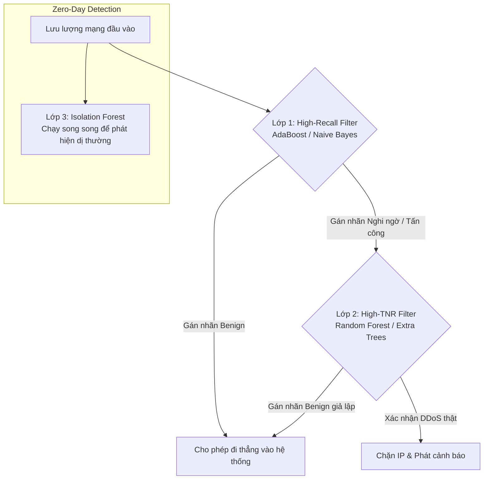

# 🛡️ Hệ Thống Phát Hiện Xâm Nhập Mạng (IDS) Ứng Dụng Trí Tuệ Nhân Tạo (AI)
### 👥 Bài tập lớn Nhóm 10 - An toàn thông tin

Dự án này là một ứng dụng phát hiện xâm nhập mạng (IDS) hoàn chỉnh, kết hợp cả học máy có giám sát (Supervised Learning) và học không giám sát (Anomaly Detection) để nhận diện các cuộc tấn công mạng (DoS, DDoS, Port Scan, Infiltration, Web Attacks) dựa trên dữ liệu lưu lượng gói tin.

Ứng dụng đã được tối ưu hóa, loại bỏ các file nháp/thực nghiệm tạm thời và đóng gói gọn gàng đi kèm file tự động chạy `run.bat`.

---

## 📁 Cấu trúc Thư mục Đóng gói (Rearranged Structure)

```text
Nhóm 10 - ATTT/
├── data/
│   ├── raw/                 # Chứa các file CSV dữ liệu gốc CICIDS2017 phục vụ huấn luyện ( Tuesday/Wednesday/Thursday)
│   ├── processed/           # Dữ liệu sau khi xử lý và chuẩn hóa (thư mục trống phục vụ lưu trữ trung gian)
│   └── external/            # File kiểm thử mù Friday Afternoon DDoS và các biểu đồ đầu ra đã vẽ sẵn:
│                            ├── large_ddos_availability_test.csv  # 50,000 luồng kiểm thử mù
│                            ├── availability_comparison.png       # Biểu đồ ROC & Precision-Recall
│                            ├── confusion_matrices.png            # Lưới ma trận nhầm lẫn
│                            ├── decision_boundaries.png           # Ranh giới quyết định 2D
│                            ├── tradeoff_curves.png               # Đường cong đánh đổi Recall vs TNR
│                            └── feature_importance.png            # Xếp hạng thuộc tính Gini Importance
├── models/                  # Lưu trữ 11 mô hình đã huấn luyện (.pkl) và bộ chuẩn hóa scaler (.pkl)
├── src/                     # Mã nguồn ứng dụng core Python
│   ├── __init__.py
│   ├── cli_visualizer.py     # Bộ hiển thị giao diện bảng biểu CLI trực quan
│   ├── config.py             # Cấu hình siêu tham số, ngưỡng cảnh báo, 15 đặc trưng chọn lọc
│   ├── evaluate.py           # Đánh giá kiểm thử chéo trên file CSV bên ngoài
│   ├── live_sniffer.py       # Capture gói tin thời gian thực bằng Scapy & phân loại trực tuyến
│   ├── models.py             # Định nghĩa/khởi tạo 11 lớp mô hình học máy
│   ├── preprocessing.py      # Tiền xử lý dữ liệu, chuẩn hóa (StandardScaler), xử lý mất cân bằng
│   ├── run_availability_test.py # Chạy giả lập kiểm thử mù 50k luồng & tính toán Bayes
│   └── train.py              # Huấn luyện mô hình (hỗ trợ tạo Mock Data nếu thiếu file raw)
├── run.bat                  # File khởi chạy tự động (Tự tạo venv, cài đặt thư viện và chạy ứng dụng)
├── run_project.py           # File điều phối menu CLI chính của ứng dụng
├── requirements.txt         # Danh sách thư viện Python cần thiết
├── BAO_CAO_IDS_AI_v4.docx   # Báo cáo chuyên đề hoàn chỉnh (v4) chứa toán học chuyên sâu & biểu đồ thực nghiệm
└── README.md                # Tài liệu hướng dẫn sử dụng này (File .md duy nhất)
```

---

## 🚀 Hướng dẫn Cài đặt & Sử dụng Nhanh

Ứng dụng được thiết kế để chạy cực kỳ đơn giản trên hệ điều hành Windows thông qua file đóng gói tự động `run.bat`.

### Cách chạy:
1. Nhấp đúp chuột vào file `run.bat` (hoặc chạy từ cmd/PowerShell: `.\run.bat`).
2. Script sẽ tự động:
   * Kiểm tra phiên bản Python trên máy tính.
   * Tự tạo môi trường ảo Python cô lập (`venv`) nếu chưa có để tránh xung đột thư viện.
   * Kích hoạt `venv` và nâng cấp `pip`.
   * Cài đặt tự động toàn bộ thư viện cần thiết từ `requirements.txt`.
   * Khởi chạy bảng điều khiển trung tâm (`run_project.py`).

> [!NOTE]
> Trên hệ điều hành Windows, module giám sát thời gian thực (`live_sniffer.py`) bắt buộc cần cài đặt công cụ **Npcap** để bắt gói tin ở tầng thấp. Bạn có thể tải miễn phí tại: [https://npcap.com/](https://npcap.com/)

---

## 🎮 Các Chức năng Trên Giao diện Điều khiển (Menu CLI)

Khi chạy `run.bat`, bạn sẽ thấy một menu tương tác dạng console với các lựa chọn từ 1 đến 7:

* **[1] Cài đặt Thư viện Phụ thuộc (pip install):** Cài đặt hoặc cập nhật thủ công các thư viện trong `requirements.txt`.
* **[2] Huấn luyện Mô hình & So sánh Thuật toán (train.py):**
  * Huấn luyện 11 mô hình dựa trên dữ liệu lưu lượng mạng của ngày thứ Ba/Tư/Năm (tránh rò rỉ dữ liệu).
  * Hạn chế hiện tượng quá khớp (Overfitting) của mô hình cây bằng cách thiết lập giới hạn chiều sâu (`max_depth`).
  * *Nếu chưa tải dữ liệu CICIDS2017 về thư mục `data/raw/`*, hệ thống sẽ tự động tạo tập dữ liệu giả lập (mock data) để bạn chạy thử nghiệm luồng code huấn luyện ngay lập tức.
* **[3] Kiểm thử chéo với Dataset bên ngoài (.csv) (evaluate.py):** Tải các mô hình đã lưu từ thư mục `models/` để dự đoán và đánh giá hiệu năng của một file CSV lưu lượng tùy chọn.
* **[4] Chạy sniffer mạng trực tiếp trên Máy tính (live_sniffer.py):**
  * Yêu cầu mở Command Prompt/PowerShell bằng quyền **Administrator** (Run as Administrator) để bắt gói tin mạng.
  * Lựa chọn mô hình AI (như Random Forest, AdaBoost, Logistic...) để làm bộ phân loại.
  * Ứng dụng sẽ bắt trực tiếp các gói tin đi qua card mạng máy tính của bạn, gộp thành luồng (Flow), tính toán 15 đặc trưng cốt lõi và đưa ra cảnh báo độc hại màu đỏ trực quan trên màn hình console nếu phát hiện tấn công.
* **[5] Mô phỏng & Đánh giá Tính Sẵn sàng Máy chủ (run_availability_test.py):**
  * Thực hiện bài đánh giá mù (Blind Test) quy mô lớn trên **50,000 dòng luồng mạng DDoS** (trích xuất độc lập từ ngày thứ Sáu của bộ CICIDS2017).
  * So sánh hiệu năng của cả 10 mô hình học máy có giám sát ở cả hai khía cạnh: Bảo mật (Recall) và Tính Sẵn sàng (TNR - True Negative Rate).
  * Tính toán chỉ số chính xác thực tế khi cảnh báo xảy ra $P(\text{Attack} | \text{Alert})$ áp dụng Định lý Bayes trong môi trường thực tiễn có tỷ lệ tấn công tự nhiên rất thấp ($\theta = 0.1\%$ và $5\%$) nhằm vạch trần ngụy biện tỷ lệ cơ sở (Base Rate Fallacy).
* **[6] Đọc Tài liệu Hướng dẫn (README.md):** Đọc nhanh nội dung hướng dẫn này ngay trên màn hình console CLI.
* **[7] Thoát:** Đóng chương trình và tự động giải phóng môi trường ảo.

---

## 🔬 Nguyên lý Lọc Phân Tầng Đã Được Khắc Phục (Sequential Filtering Logic)

Trong phiên bản v3 trước đây, đề xuất vận hành tuần tự bị lỗi logic nghiêm trọng khi đặt **Random Forest** làm bộ lọc sơ cấp vì mô hình này có Recall trên tập blind test khá thấp (63.75%), làm bỏ sót tới 36.25% các cuộc tấn công DDoS ngay từ vòng ngoài và khóa cứng trần Recall của toàn hệ thống ở mức 63.75%.

Trong **phiên bản v4 mới nhất** (chi tiết trong báo cáo `BAO_CAO_IDS_AI_v4.docx`), kiến trúc phân tầng đã được sửa đổi chính xác theo nguyên lý dòng chảy dữ liệu thực tế:



### Chi tiết các lớp phân tầng:
1. **Lớp 1 (Màng lọc sơ cấp - Bộ lọc High-Recall):** 
   * Sử dụng **AdaBoost** (Recall 98.35%) hoặc **Naive Bayes** (Recall 99.76%) để làm chốt chặn đầu tiên. Mục tiêu là bắt giữ gần như 100% mọi luồng tấn công, không chấp nhận bỏ sót (minimize False Negatives). 
   * Vì các mô hình này có TNR khá thấp (có nhiều False Alarms), lưu lượng bị gán nhãn nghi ngờ sẽ chưa bị chặn ngay mà được chuyển tiếp qua Lớp 2.
2. **Lớp 2 (Màng lọc thứ cấp - Bộ lọc High-TNR/High-Precision):**
   * Sử dụng **Random Forest** (TNR 98.69%) hoặc **Extra Trees** (TNR 99.39%) để kiểm tra chéo các cảnh báo nghi ngờ từ Lớp 1.
   * Lớp này đóng vai trò loại bỏ triệt để các cảnh báo giả do Lớp 1 tạo ra đối với người dùng bình thường, giữ vững tính sẵn sàng và băng thông cho máy chủ.
3. **Lớp 3 (Phát hiện Anomaly/Zero-day):** 
   * Chạy song song **Isolation Forest** trên các luồng thông thường để phát hiện các cuộc tấn công dị thường chưa từng có trong tập dữ liệu huấn luyện.

---

## 📝 Thông tin Nhóm Thực hiện (Nhóm 10)
Mọi thắc mắc và đóng góp ý kiến về hệ thống IDS AI này, vui lòng tham khảo chi tiết trong tệp báo cáo học thuật chuyên sâu [BAO_CAO_IDS_AI_v4.docx](file:///C:/Users/Hikari-Rainbow/antigravity/wise-einstein/BAO_CAO_IDS_AI_v4.docx) được đính kèm ở thư mục gốc của dự án.
