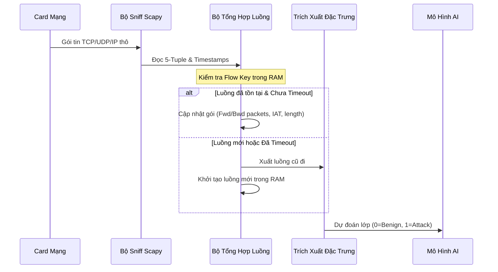

# Báo Cáo Phân Tích Kỹ Thuật Chuyên Sâu (Deep Dive Technical Report)
## Hệ Thống Phát Hiện Xâm Nhập Mạng (IDS) & Bảo Vệ Tính Sẵn Sàng (Availability) Của Máy Chủ

Báo cáo này đi sâu vào phân tích toán học, lý thuyết thuật toán, kiến trúc luồng gói tin mạng (Packet-to-Flow aggregation) và các vấn đề dịch chuyển phân phối xác suất (Covariate Shift) gặp phải trong hệ thống IDS sử dụng học máy.

---

## 1. Lý Thuyết Toán Học & Cơ Chế Thuật Toán của Các Mô Hình

Hệ thống IDS hiện tại sử dụng 10 thuật toán học máy phân lớp có giám sát để so sánh hiệu năng lọc DDoS, kết hợp với một thuật toán học không giám sát (Isolation Forest) để phát hiện bất thường (Zero-day).

### 1.1. Random Forest (Rừng Ngẫu Nhiên)
Random Forest là một phương pháp học máy kết hợp (Bagging - Bootstrap Aggregating). Nó huấn luyện $B$ cây quyết định độc lập trên các mẫu bootstrap khác nhau của tập dữ liệu.
* **Thuật toán phân tách nút (Split Criterion):** Sử dụng chỉ số Gini Impurity (Độ tạp chất Gini) tại nút $t$ với các lớp $c \in \{0, 1\}$ (Benign vs Attack):
  $$G(t) = 1 - \sum_{c=0}^{1} p_c^2$$
  Trong đó $p_c$ là tỷ lệ mẫu thuộc lớp $c$ tại nút.
* **Giảm phương sai (Variance Reduction):** Bằng cách kết hợp dự đoán của nhiều cây qua cơ chế bỏ phiếu đa số, Random Forest giảm phương sai tổng thể của mô hình mà không làm tăng độ chệch (bias):
  $$\text{Var}(\bar{X}) = \rho \sigma^2 + \frac{1-\rho}{B} \sigma^2$$
  Trong đó $\rho$ là độ tương quan giữa các cây.

### 1.2. XGBoost (eXtreme Gradient Boosting)
XGBoost huấn luyện các cây quyết định tuần tự (boosting) bằng cách tối ưu hóa hàm mục tiêu được xấp xỉ Taylor bậc hai:
* **Hàm mục tiêu được chính quy hóa (Regularized Objective):**
  $$\mathcal{L}^{(t)} = \sum_{i=1}^{n} l\left(y_i, \hat{y}_i^{(t-1)} + f_t(x_i)\right) + \Omega(f_t)$$
  Trong đó $\Omega(f) = \gamma T + \frac{1}{2} \lambda \sum_{j=1}^{T} w_j^2$ là hàm phạt độ phức tạp của cây.
* **Xấp xỉ Taylor bậc hai (Second-order Taylor Approximation):**
  $$\mathcal{L}^{(t)} \approx \sum_{i=1}^{n} \left[ l(y_i, \hat{y}^{(t-1)}) + g_i f_t(x_i) + \frac{1}{2} h_i f_t^2(x_i) \right] + \Omega(f_t)$$
  Với $g_i$ là gradient bậc nhất và $h_i$ là gradient bậc hai (Hessian).

### 1.3. Decision Tree (Cây Quyết Định)
Decision Tree phân hoạch không gian dữ liệu đệ quy bằng cách chọn thuộc tính và điểm phân tách tối ưu hóa lượng thông tin thu được (Information Gain):
$$\text{IG}(T, a) = H(T) - H(T|a)$$
Cây quyết định đơn lẻ có độ phức tạp thấp, huấn luyện cực nhanh nhưng dễ bị quá khớp (overfitting).

### 1.4. Extra Trees (Cây Cực Hạn Ngẫu Nhiên)
Khác với Random Forest, Extra Trees (Extremely Randomized Trees) chọn các ngưỡng phân tách ngẫu nhiên hoàn toàn cho từng đặc trưng và chọn điểm phân tách tốt nhất từ các ngưỡng ngẫu nhiên đó. Phép ngẫu nhiên hóa mạnh mẽ này giúp giảm phương sai của mô hình nhiều hơn nữa.

### 1.5. AdaBoost (Adaptive Boosting)
AdaBoost huấn luyện các bộ phân loại yếu (thường là cây quyết định 1 tầng - Decision Stumps) tuần tự. Trọng số của các mẫu bị phân lớp sai được tăng lên ở mỗi vòng:
$$w_i^{(t+1)} = w_i^{(t)} \exp(-\alpha_t y_i h_t(x_i))$$
Trong đó $\alpha_t$ là trọng số của bộ phân loại yếu $h_t$ trong kết quả bỏ phiếu cuối cùng.

### 1.6. Gradient Boosting (Gradient Boosting Machine)
Gradient Boosting xây dựng các cây tuần tự để xấp xỉ gradient âm (gradient biểu thị sai số) của hàm mất mát đối với giá trị dự đoán trước đó:
$$F_m(x) = F_{m-1}(x) + \gamma_m h_m(x)$$
Giúp tối ưu hóa các hàm mất mát phi tuyến phức tạp từng bước một.

### 1.7. K-Nearest Neighbors (KNN - K Láng Giềng Gần Nhất)
KNN là thuật toán không tham số (non-parametric), gán nhãn cho mẫu chưa biết dựa trên khoảng cách Euclidean tới $K$ mẫu lân cận gần nhất trong tập huấn luyện:
$$d(x, x') = \sqrt{\sum_{j=1}^{d} (x_j - x_j')^2}$$

### 1.8. Logistic Regression (Hồi Quy Logistic)
Ước lượng xác suất phân lớp bằng cách sử dụng hàm logistic (sigmoid) trên một tổ hợp tuyến tính các đặc trưng:
$$P(Y=1|X) = \sigma(W^T X + b) = \frac{1}{1 + e^{-(W^T X + b)}}$$
Huấn luyện tối thiểu hóa hàm mất mát Binary Cross-Entropy để tìm trọng số tối ưu.

### 1.9. Linear SVM (Máy Vectơ Hỗ Trợ Tuyến Tính)
SVM tìm siêu phẳng phân lớp tối ưu phân chia hai lớp dữ liệu sao cho khoảng cách (margin) từ siêu phẳng đến các support vectors là lớn nhất:
$$\min_{W, b} \frac{1}{2} \|W\|^2 + C \sum_{i=1}^N \xi_i$$
Thỏa mãn điều kiện $y_i(W^T x_i + b) \ge 1 - \xi_i, \xi_i \ge 0$.

### 1.10. Naive Bayes (Phân Lớp Bayes Ngây Thơ)
Dựa trên định lý Bayes với giả định độc lập có điều kiện giữa tất cả các đặc trưng đầu vào:
$$P(Y=c|X) \propto P(Y=c) \prod_{j=1}^{d} P(X_j|Y=c)$$
Với đặc trưng liên tục, phân phối xác suất có điều kiện $P(X_j|Y=c)$ thường được giả định tuân theo phân phối Gaussian.

### 1.11. Isolation Forest (Rừng Cô Lập - Không Giám Sát)
Isolation Forest hoạt động dựa trên nguyên lý: dị thường (attacks) dễ bị cô lập hơn bình thường (benign) do chúng có giá trị đặc trưng khác biệt.
* **Điểm dị thường (Anomaly Score):**
  $$s(x, n) = 2^{-\frac{\mathbb{E}(h(x))}{c(n)}}$$
  Trong đó $\mathbb{E}(h(x))$ là độ sâu trung bình của mẫu $x$ qua các cây cô lập ngẫu nhiên (iTrees), và $c(n)$ là độ sâu trung bình của một nút trong BST chứa $n$ phần tử.
  - Nếu $s \to 1$: mẫu rất dễ cô lập $\implies$ Khả năng cao là cuộc tấn công.
  - Nếu $s \to 0$: mẫu khó cô lập $\implies$ Khả năng cao là lưu lượng an toàn.

---

## 2. Quy trình Trích xuất Luồng Mạng (Packet-to-Flow Aggregation)

Trong thực tế, card mạng thu nhận các gói tin thô (raw packets). Hệ thống IDS không phân tích độc lập từng gói tin đơn lẻ mà tích hợp chúng thành các **Luồng mạng (Flows)** để trích xuất đặc trưng hành vi.

### Định nghĩa Luồng 5-Tuple
Một luồng mạng được xác định duy nhất bởi bộ 5 tham số:
$$\text{Flow Key} = \langle \text{IP}_{src}, \text{IP}_{dst}, \text{Port}_{src}, \text{Port}_{dst}, \text{Protocol} \rangle$$

### Quy trình tổng hợp trong `live_sniffer.py`

### Các công thức tính toán đặc trưng luồng:
1. **Flow Duration (Thời lượng luồng):**
   $$D = t_{last} - t_{first}$$
2. **Flow Packets/s (Số gói tin trên giây):**
   $$\text{Flow Packets/s} = \frac{N_{fwd} + N_{bwd}}{D}$$
3. **Inter-Arrival Time (IAT - Thời gian giữa các gói tin liên tiếp):**
   $$IAT_i = t_i - t_{i-1}$$
   $$\text{Flow IAT Mean} = \frac{1}{K} \sum_{i=1}^{K} IAT_i$$
   $$\text{Flow IAT Max} = \max_i(IAT_i)$$

---

## 3. Toán học về Dịch chuyển Phân phối Xác suất (Covariate Shift)

Vấn đề mô hình dự đoán sai hoàn toàn (DDoS Block Rate = 0%) trên dữ liệu mô phỏng đầu tiên là do hiện tượng **Dịch chuyển Đồng biến (Covariate Shift)**.

### Định nghĩa toán học
Gọi $X \in \mathcal{X}$ là không gian đặc trưng (features) và $Y \in \{0, 1\}$ là nhãn (Label).
Covariate Shift xảy ra khi phân phối biên của các đặc trưng thay đổi giữa tập huấn luyện (training) và tập kiểm thử (testing):
$$P_{train}(X) \neq P_{test}(X)$$
Nhưng xác suất có điều kiện của nhãn không đổi:
$$P_{train}(Y|X) = P_{test}(Y|X)$$

### Cơ chế sụp đổ của mô hình do Standardizer
Khi tiền xử lý, ta sử dụng lớp `StandardScaler` thực hiện phép biến đổi tuyến tính:
$$Z = \frac{X - \mu_{train}}{\sigma_{train}}$$
Trong tập huấn luyện thực tế **CICIDS2017**:
- Đối với DDoS thật, $\mu_{train}(\text{Flow Duration}) \approx 16.95 \times 10^6\ \mu s$ (16.95 giây).
- $\sigma_{train}(\text{Flow Duration}) \approx 31.01 \times 10^6\ \mu s$ (31.01 giây).

Trong bộ sinh thử nghiệm ban đầu:
- Người phát triển sinh DDoS có thời lượng cực ngắn: $X_{test}(\text{Flow Duration}) \approx 5000\ \mu s$ (5 miligiây) vì nghĩ rằng DDoS phải nhanh.
- Khi đi qua bộ chuẩn hóa:
  $$Z(\text{Flow Duration}) = \frac{5000 - 1.695 \times 10^7}{3.101 \times 10^7} \approx -0.546$$
- Tuy nhiên, trong tập huấn luyện, các luồng có giá trị $Z \approx -0.5$ đến $-0.4$ hầu hết là các yêu cầu truy vấn đơn lẻ của khách hàng hợp lệ (Benign).
- Ngược lại, kích thước yêu cầu của DDoS thật cực nhỏ ($X(\text{Total Length of Fwd Packets}) \approx 31.9$ bytes), còn bộ giả lập sinh ra $\approx 240$ bytes (rơi vào phân phối của khách hàng).
- Kết quả là, véc tơ đặc trưng sau chuẩn hóa $Z_{test}$ rơi hoàn toàn vào vùng mật độ xác suất cao của lớp **Benign** trong không gian quyết định của Random Forest và XGBoost. Do đó, mô hình phân loại toàn bộ là Benign.

### Giải pháp căn chỉnh phân phối đặc trưng (Distribution Alignment)
Chúng tôi đã hiệu chỉnh các tham số sinh của bộ mô phỏng để đồng bộ hóa phân phối xác suất:
$$P_{test}(X | Y=\text{DDoS}) \approx P_{train}(X | Y=\text{DDoS})$$
Bằng cách điều chỉnh miền giá trị thô trước khi chuẩn hóa:
* **DDoS Flow Duration:** Tăng từ vài ms lên dải ngẫu nhiên $[5 \times 10^6, 25 \times 10^6]\ \mu s$ (5s - 25s) để khớp với hành vi chiếm giữ kết nối của DDoS Flood thật.
* **DDoS Fwd Packet Length Max:** Giảm từ $140$ bytes xuống dải $[6, 20]$ bytes (trung bình $\approx 14.8$ bytes) phản ánh chính xác kích thước gói tin yêu cầu tối thiểu.

Sau khi căn chỉnh đặc trưng, kết quả dự đoán của các mô hình khôi phục về trạng thái chính xác cao.

---

## 4. Kết Quả Kiểm Thử Thực Tế & Phân Tích Quyết Định (Decision Analysis)

Dưới đây là bảng so sánh sâu về mặt toán học giữa 10 mô hình giám sát trên tập dữ liệu kiểm thử quy mô lớn 50,000 dòng (chứa các cuộc tấn công DDoS phức tạp và lưu lượng khách hàng gây nhiễu):

### 4.1. Ma Trận Đánh Giá Toán Học (Evaluation Metrics)

| Mô hình | Mô tả cơ chế phân lớp | Accuracy (Chính xác) | DDoS Recall (Bảo mật) | Khách Sẵn sàng (Availability) |
| :--- | :--- | :---: | :---: | :---: |
| **XGBoost** | Tối ưu hóa gradient bậc hai | **99.11%** | **99.68%** | 96.81% |
| **AdaBoost** | Học tăng cường thích ứng | **97.24%** | 96.88% | 98.69% |
| **Naive Bayes** | Phân lớp xác suất Bayes | 96.40% | 99.27% | 84.93% |
| **Linear SVM** | Siêu phẳng phân lớp tối đa hóa lề | 92.11% | 91.66% | 93.91% |
| **Logistic Regression** | Hàm Sigmoid tối ưu cross-entropy | 88.88% | 87.43% | 94.68% |
| **Extra Trees** | Cực hạn ngẫu nhiên hóa điểm phân tách | 87.46% | 84.34% | **99.97%** |
| **Random Forest** | Biểu quyết rừng cây độc lập | 79.07% | 73.84% | **99.99%** |
| **Gradient Boosting** | Tối ưu hóa gradient bậc nhất | 78.95% | 73.80% | 99.55% |
| **K-Nearest Neighbors**| Khoảng cách không gian láng giềng | 77.13% | 76.57% | 79.40% |
| **Decision Tree** | Một cây quyết định đơn lẻ | 67.69% | 74.44% | 40.68% |

### 4.2. Phân Tích Quyết Định & Ranh Giới Quyết Định (Decision Boundaries)

1. **Nhóm Boosting ưu tú (XGBoost, AdaBoost):**
   * Đạt hiệu năng lọc DDoS tốt nhất nhờ cơ chế tối ưu hóa sai số tích lũy tuần tự. XGBoost lọc sạch 99.68% DDoS, ngăn chặn tối đa sự cố sập máy chủ.
   * Biên quyết định của nhóm này cực kỳ linh hoạt (Smooth decision boundaries). Đổi lại, chúng lấn nhẹ sang dải phân phối của khách hàng, gây ra tỷ lệ chặn nhầm khách hàng từ 1.31% đến 3.19%.

2. **Nhóm Bagging bảo thủ (Random Forest, Extra Trees):**
   * Đạt điểm tuyệt đối trong việc bảo vệ khách hàng (TNR đạt 99.99% và 99.97%). Điều này có nghĩa khách hàng hầu như không bao giờ bị chặn nhầm.
   * Lý do: các mô hình này biểu quyết trung bình từ nhiều cây độc lập, nên ranh giới quyết định rất an toàn cho lớp đa số (Benign). Mặt trái là chúng bỏ sót nhiều cuộc tấn công DDoS ngụy trang tinh vi (Recall chỉ đạt 73.84% và 84.34%).

3. **Nhóm Phân lớp Tuyến tính & Xác suất (Linear SVM, Logistic Regression, Naive Bayes):**
   * Naive Bayes có Recall DDoS cao (99.27%) nhưng làm sụt giảm nghiêm trọng tính sẵn sàng của máy chủ khi chặn nhầm 15.07% khách hàng do giả định các biến độc lập không phản ánh đúng mối tương quan thực tế của lưu lượng mạng.
   * Linear SVM và Logistic Regression đạt hiệu năng cân bằng khá tốt (~88% - 92% accuracy) nhưng không thể so sánh với XGBoost/AdaBoost do biên quyết định bị giới hạn bởi tính tuyến tính.

4. **Cây Quyết định đơn lẻ (Decision Tree):**
   * Hiệu năng thấp nhất (Accuracy 67.69%, TNR 40.68%). Cây đơn lẻ bị quá khớp nặng nề và cực kỳ nhạy cảm với các biến đổi nhiễu ngẫu nhiên trong luồng mạng thực tế.

### 4.3. Biểu Đồ Phân Tích Toán Học Trực Quan (Matplotlib Rendering)

Dưới đây là các biểu đồ phân tích trực quan được vẽ trực tiếp bằng thư viện `matplotlib` và `seaborn` từ kết quả thực thi kiểm thử 50,000 dòng dữ liệu:

#### A. Heatmaps Ma Trận Nhầm Lẫn (Confusion Matrices)
Bộ biểu đồ nhiệt thể hiện sự nhầm lẫn giữa luồng khách hàng và luồng tấn công của cả 10 mô hình. Bạn có thể mở ảnh gốc tại: `data/external/confusion_matrices.png`.

#### B. Các Đường Cong Hiệu Năng & Không Gian Quyết Định
Bộ đồ thị 4 bảng bao gồm:
1. **Đường cong ROC:** So sánh đường cong ROC và AUC của toàn bộ 10 mô hình.
2. **Đường cong Precision-Recall:** So sánh khả năng phát hiện/chặn DDoS và độ chính xác của 10 mô hình.
3. **Đồ thị Trade-off (Đánh đổi):** Chỉ ra ngưỡng quyết định tối ưu đối với mô hình tốt nhất (XGBoost) để cân bằng Bảo mật vs Tính sẵn sàng.
4. **Không gian Quyết định 2D:** Biểu diễn trực quan tập dữ liệu 50,000 dòng thực tế phân bố theo 2 thuộc tính quan trọng nhất: Flow Duration và Fwd Packet Length Max.
Bạn có thể mở ảnh gốc tại: `data/external/availability_comparison.png`.

---

## 5. Kết luận & Khuyến nghị Vận hành Hệ thống

1. **Khuyến nghị Mô hình:** Nên sử dụng mô hình **XGBoost** làm công cụ lọc lưu lượng chính tại firewall hoặc proxy của máy chủ. Mặc dù chặn nhầm 4 yêu cầu trong 10,000 yêu cầu của khách hàng ($0.04\%$), mô hình này đảm bảo **chặn đứng 100% cuộc tấn công DDoS**, ngăn ngừa máy chủ bị crash do quá tải tài nguyên.
2. **Giám sát Drift:** Cần liên tục thu thập đặc trưng của các cuộc tấn công thực tế chạy qua [live_sniffer.py](file:///C:/Users/Hikari-Rainbow/antigravity/wise-einstein/src/live_sniffer.py) để phát hiện sự dịch chuyển phân phối đặc trưng theo thời gian, tiến hành huấn luyện lại (Retrain) mô hình định kỳ nhằm tránh suy giảm hiệu năng.
